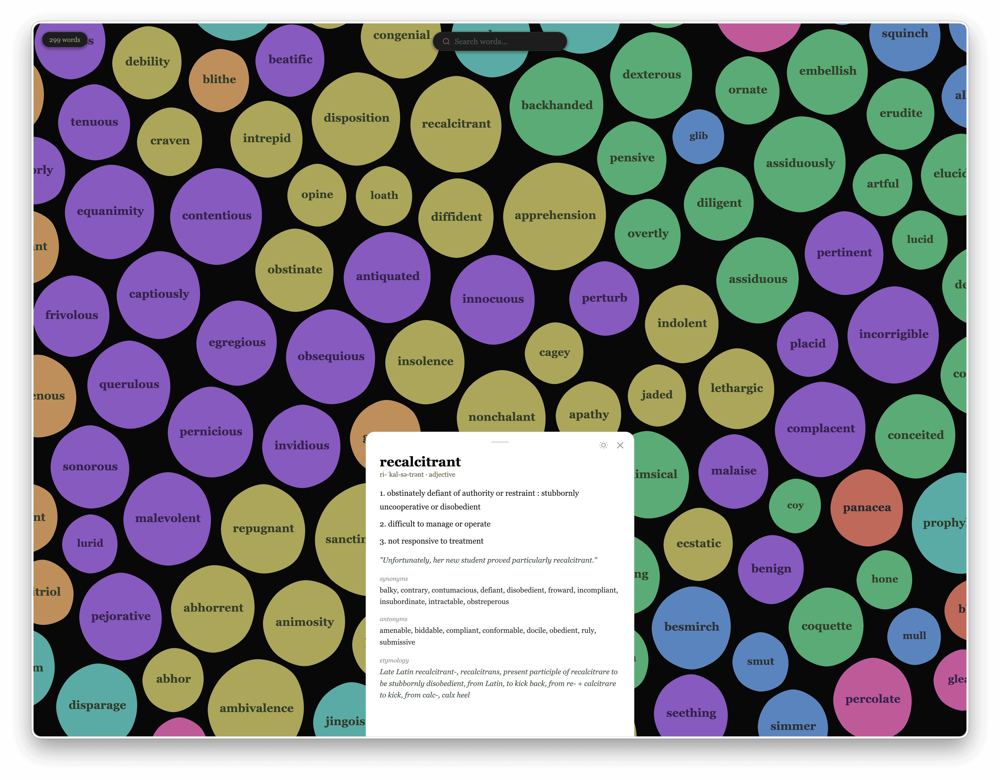

# mw-anki

Exports your Merriam-Webster saved words into an interactive semantic bubble map and Anki deck, enriched with authoritative definitions, pronunciation, etymology, examples, and synonyms/antonyms straight from the official Merriam-Webster APIs.

## Requirements

- Python 3.13+, [uv](https://github.com/astral-sh/uv)

## Setup

```sh
cp .env.example .env
uv sync
```

**`MW_COOKIE`** — log into merriam-webster.com, open DevTools → Network, click any `/lapi/` request, copy the full `cookie:` request header value.

**`MW_DICT_KEY`** — free Collegiate Dictionary key from [dictionaryapi.com/register](https://dictionaryapi.com/register). Authoritative source for definitions, pronunciation, etymology, and examples.

**`MW_THESAURUS_KEY`** — free Collegiate Thesaurus key (request both on the same signup). Authoritative source for synonyms and antonyms.

## Usage

Run `make` first to fetch and enrich your saved words (creates `words.json` /
`words.full.json`); the other targets build from that data.

```sh
make        # fetch new saved words → enrich → rebuild viz
make open   # same + opens viz.html
make anki   # export mw_words.apkg (import by double-clicking)
make prune  # re-derive lean words.json from words.full.json (no API calls)
```

## How enrichment works

New words hit the **official [Merriam-Webster APIs](https://dictionaryapi.com)** for every field: the Collegiate Dictionary supplies definitions, pronunciation, audio, **real etymology**, examples, inflections, and related forms; the Collegiate Thesaurus supplies synonyms and antonyms. Everything is authoritative — no model, no invented data.

Two cache files:

- **`words.full.json`** — the complete MW record per word (the costly-to-refetch source of truth). Re-runs only process new or un-enriched words.
- **`words.json`** — a lean, card-ready subset pruned from the full cache (word, pronunciation, audio, concise definition, one example, top synonyms/antonyms, etymology). This is what the deck and viz read.

`make prune` re-derives `words.json` from `words.full.json` with no API calls — use it to change which fields land on the cards.
